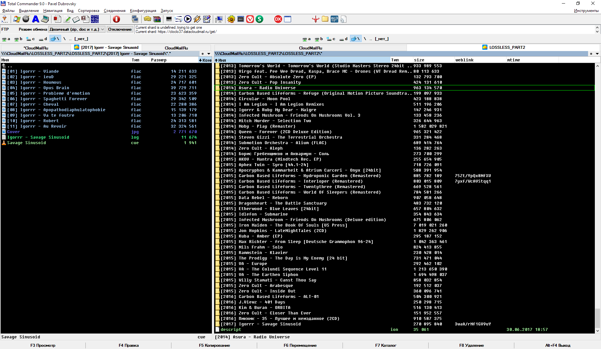

# Плагин [Total Commander](http://www.ghisler.com/) для работы с [cloud.mail.ru](http://cloud.mail.ru)

### Описание
Данная программа является плагином виртуальной файловой системы (WFX) для файлового менеджера Total Commander, реализующим взаимодействие с сервисом cloud.mail.ru (Облако Mail.ru) через WEB API.
В текущей версии плагином поддерживаются:
* Работа с несколькими аккаунтами
* Навигация по каталогам
* Скачивание файлов из Облака
* Заливка файлов в Облако
* Удаление файлов в Облаке
* Переименование/перемещение файлов в Облаке
* Просмотр свойств файла в Облаке через набор дополнительных колонок TC
* Работа с правами доступа на каталоги и файлы
* Работа с публичными ссылками в режиме только для чтения
* Файловые комментарии в Облаке
* Сохранение и восстановление времени изменения файлов
* Просмотр истории версий файлов с возможностью восстановления и отката
* Шифрование на лету

Реализован только Unicode-набор функций, на не NT-версиях Windows плагин работать не будет.
TCx64 поддерживается полностью.

Перед использованием ознакомьтесь с [лицензионным соглашением по использованию Сервиса Облако@mail.ru](https://cloud.mail.ru/LA/)

### Разработчику

Плагин реализует веб-версию API Облака Mail.ru, полученную в результате реверс-инжиниринга сайта Облака. Код написан и тестировался в Embarcadero® Delphi 10 с использованием комплектной библиотеки Indy и библиотеки компонентов [DCPcrypt Cryptographic Component Library v2](http://www.cityinthesky.co.uk/) by David Barton (включены в репозиторий).

Проект может быть собран из Embarcadero® Delphi 10 любой версии стандартным способом (MailRuCloud.dproj => Shift+F9).

Для ознакомления с разработкой файлсистемных плагинов Total Commander ознакомьтесь с [документацией и примерами](http://ghisler.fileburst.com/fsplugins/fspluginhelp2.1se_chm.zip) от разработчика.

### Установка и использование
Скачайте [текущий стабильный релиз](https://github.com/pozitronik/CloudMailRu/releases/latest), распакуйте его, и подключите плагин MailRuCloud.wfx/MailRuCloud.wfx64 (при правильном подключении плагин появится в панели "Сетевое окружение"). Вызовите настройки плагина (Alt+Enter), и добавьте все необходимые аккаунты. 
При возникновении вопросов по установке и использованию плагинов в Total Commander обратитесь к его справке.

# Авторизация
После миграции mail.ru на VK ID, авторизация через обычный логин/пароль более не поддерживается. Плагин использует OAuth-авторизацию с паролем приложения.

## Создание пароля приложения
Для работы плагина необходимо создать пароль приложения:
1. Перейдите на страницу [id.mail.ru](https://id.mail.ru/) и войдите в свой аккаунт.
2. Откройте раздел "Безопасность" → "Пароли приложений" (или напрямую [https://id.mail.ru/security](https://id.mail.ru/security)).
3. Нажмите "Добавить" и создайте новый пароль приложения.
4. **Важно:** При создании пароля выберите "Полный доступ к почте, облаку и календарю" (все протоколы). Ограниченный доступ только к WebDAV не работает с плагином.
5. Скопируйте сгенерированный пароль и используйте его в настройках плагина.

**Примечание:** Обычный пароль от аккаунта mail.ru работать не будет. Используйте только пароль приложения.

## Двухфакторная аутентификация (2FA)
Пароли приложений не требуют двухфакторной аутентификации. Если на вашем аккаунте включена 2FA, плагин будет работать корректно - пароль приложения создаётся после прохождения двухфакторной проверки и не требует повторного ввода кода при каждом подключении.

# Хранение паролей
Сохранённые пароли приложений по умолчанию будут сохранены в открытом виде. 
Пароли можно не указывать, в этом случае они будут запрашиваться при каждом подключении. 
Также возможно использование встроенного в TC менеджера паролей (опция "Store password in TC password manager" в настройках).

# Стандартные и публичные аккаунты
Плагин поддерживает два варианта работы с Облаком. Стандартный - когда у вас есть логин и пароль от аккаунта, и публичный - когда у вас есть публичная ссылка вида https://cloud.mail.ru/public/ABCD/NhEYwQELx. В первом случае будут доступны все возможности Облака, во втором - будет доступно только чтение каталогов и скачивание файлов.

# Получение прямых ссылок на файлы
Плагин поддерживает получение прямых ссылок для файлов, к которым предоставлен публичный доступ. Эта возможность доступна при вызове свойств файла/каталога в Облаке, при этом в публичных аккаунтах прямые ссылки могут быть получены сразу, в стандартных - после предоставления к ним публичного доступа. При этом для каталогов рекурсивно запрашиваются прямые ссылки на все объекты внутри каталога. 
Полученные списки можно использовать в сторонних программах, например - в качестве онлайн-плейлистов для медиаплеера.

# Получение хеш-ссылок на файлы
Плагин поддерживает работу с файлами в Облаке через их хеши: уникальная ссылка на каждый файл может быть представлена в виде комбинации его хеша и размера. Такие ссылки можно получить на вкладке "Hashes list" при вызове свойств файла/каталога, там же можно создать файлы по ссылкам (в т.ч. и пакетно).

См. также описание опции ["Try to find files by hash before uploading"](#try-to-find-files-by-hash-before-uploading) и описание команды **hash**.

# Настройки плагина

## Global settings

### Load SSL libraries only from plugin directory
При включении опции плагин будет пытаться загрузить SSL-библиотеки из собственного каталога, в случае существования подкаталогов /x32 и /x64 - загрузка будет производиться из каталога по соответствию разрядности используемой версии плагина. Если опция отключена, то плагин попытается загрузить библиотеки, найденные в системе.

### Enable space info logging
При включении опции плагин будет запрашивать информацию о занятом месте, и выводить её в протокол после завершения любых файловых операций.

### Preserve file creation time
При включении опции плагин будет пытаться устанавливать для всех скачиваемых файлов время создания, время изменения и время последнего доступа равными тому, что установлены в Облаке (время загрузки файла в Облако). В противном случае будет установлено текущее время. 
**Важно:** установка времени файлов в Облаке не поддерживается API, эта опция работает только при скачивании.

### Show accounts trash folders
Опция включает отображение Корзины для всех стандартных аккаунтов (в список соединений добавляются папки вида %connection_name%.trash). Подробнее о функционале Корзины см. ниже.

### Show accounts shared links folders
Опция включает отображение списка общих ссылок для всех стандартных аккаунтов (в список соединений добавляются папки вида %connection_name%.shared). Подробнее об этом функционале см. ниже.

### Show accounts invites folders
Опция включает отображение списка входящих ссылок для всех стандартных аккаунтов (в список соединений добавляются папки вида %connection_name%.invites). Подробнее об этом функционале см. ниже.

### Override split file size to
Облако ограничивает максимальный размер файла для бесплатных аккаунтов. Официально это ограничение указано как 2GiB, но по факту оно всегда чуть меньше (по всей видимости, в этот размер включена длина имени файла). Поэтому плагин считает таким ограничением величину 2147483392 байт (2GiB - 256). Если включить опцию "Split large files to 2Gb parts", плагин будет разбивать закачиваемый файл на части именно этого размера. 
При необходимости существует возможность переопределить эту величину. Для этого задайте этому параметру необходимое значение в байтах, например 200000000. 

### On downloads/uploads error
Определяет поведение плагина при ошибках операций скачивания/закачивания файлов и копировании/перемещении файлов между аккаунтами. Доступны следующие режимы:
- Ask user: при ошибке будет выведен запрос с вариантами "Отмена" (прекращает операцию), "Повтор" (повторяет операцию с файлом), "Игнорировать" (пропускает файл, продолжает операцию со следующим файлом).
- Ignore file: пропускает все файлы, при обработке которых возникли ошибки.
- Abort operation: прекращает операцию при первой же ошибке.
- Retry with this file: повторяет операцию с файлом до тех пор, пока а) не истечёт количество попыток, заданное в параметре Retry attempts; б) операция не завершится успешно; в) пользователь вручную не прекратит операцию. 
**Режим разбиения:** данный параметр аналогичным образом определяет поведение при ошибках загрузки частей разбитых файлов (для каждой отдельной части).

### Retry attempts
Количество повторов операций при ошибках, в случае выбора режима "Retry with this file". Отрицательные значения принимаются за бесконечное число попыток. 
**Режим разбиения:** данный параметр аналогичным образом определяет поведение при ошибках загрузки частей разбитых файлов (для каждой отдельной части).

### Wait
Время в миллисекундах между повторами операций в случае выбора режима "Retry with this file".
 
**Режим разбиения:** данный параметр аналогичным образом задаёт таймаут ожидания между повторми операций при загрузке частей разбитых файлов (для каждой отдельной части).

### Copying/moving between accounts mode:
По умолчанию в плагине отключены файловые операции между аккаунтами (см [обсуждение](https://github.com/pozitronik/CloudMailRu/issues/55#issuecomment-258607586)). Это ограничение можно обойти, совершая операции с файлами через их хеш (опция "Via hash"), или через публичные ссылки (опция "Via public link").

При выборе опции "Via public link" плагин будет пытаться выполнить операции с файлами, создавая для каждого из них публичную ссылку (если она отсутствует у файла). После завершения операции ссылка удаляется (если до этого она не существовала).

Поскольку операции над большим массивом файлов могут быть продолжительными, рекомендуется выполнять перенос файлов между аккаунтами через команду **clone**.

### Overwrite splitted chunk mode:
При включении опции "Split large files to 2Gb parts" возможна ситуация, когда части разбитого файла уже существуют в Облаке. Поскольку невозможно выдать запрос на перезапись файла в этом случае (Total Commander ничего не знает о разбиении файла, для него вся операция происходит атомарно), поведение плагина будет определяться этой настройкой. По умолчанию все существующие части файла будут перезаписаны.

### Delete file after upload mode:
Эта опция определяет поведение плагина в случае, когда перемещаемый из локальной файловой системы файл невозможно удалить (например, при наличии у него атрибута Read Only). По умолчанию плагин запросит выбор действия у пользователя.

### Overwrite local files mode:
Эта опция позволяет переопределить стандартное поведение плагина при попытке перезаписи существующего локального файла (это может быть полезно при синхронизации и других длительных операциях). По умолчанию поведение не переопределяется (плагин будет запрашивать выбор действия у пользователя).

### Plugin icons mode:
Эта опция переключает режимы отображения иконок для специальных каталогов (в скобках дано название внешнего файла иконки): каталог аккаунта (cloud.ico), каталог публичного аккаунта (cloud\_public.ico), каталоги с публичным доступом (shared.ico), каталоги с общедоступной публичной ссылкой (shared\_public.ico).

Доступны следующие режимы:
- System default: отображается стандартная системная иконка для всех каталогов.
- Internal icons: для специальных каталогов отображаются только встроенные иконки.
- Internal icons overlay: встроенные иконки накладываются на стандартную системную иконку каталога.
- External icons: иконки специальных каталогов подгружаются из подкаталога icons в каталоге плагина.
- External icons overlay: иконки специальных каталогов подгружаются из подкаталога icons в каталоге плагина и накладываются на стандартную системную иконку каталога.

Размер иконок считывается из конфигурационного файла Total Commander. TC позволяет установить нестандартные размеры иконок, в таких случаях плагин попытается получить наиболее близкие по размеру системные иконки. Однако, в режимах с наложением результирующие иконки могут выглядеть размыто.

Для применения этой настройки требуется перезапуск TC.

### Disable background operations support
Эта опция отключает поддержку фоновых операций в плагине (для применения требуется перезапуск TC).

### URL encode direct download links
Эта опция включает представление прямых ссылок в формате URL-encoded. Кодированные ссылки корректно работают в большинстве программ, в отличие от некодированных (которые более человекочитаемы).

### Update direct download links immediately
При включении этой опции плагин начнёт запрашивать список прямых ссылок немедленно после открытия свойств публичного объекта, либо после того, как публичная ссылка будет создана. Если опция выключена, для получения ссылок потребуется нажать кнопку обновления.

### Try to find files by hash before uploading
Каждый файл в Облаке может быть идентифицирован по уникальному хеш-ключу, причём одинаковые файлы имеют одинаковые хеши. Таким образом, глобально Облако хранит фактически только одну копию каждого файла, даже если сам файл есть у многих пользователей. 
При включении этой опции плагин вычисляет хеш для каждого закачиваемого файла и пытается найти этот файл в Облаке. В случае, если такой файл уже есть, то он добавляется без фактической передачи данных, в противном случае происходит обычная процедура заливки файла в Облако. 
**Режим разбиения:** при включении данного параметра плагин будет пытаться найти соответствующие хеши как для целого файла, так и для каждой отдельно загружаемой части (если целый файл не найден). 
**Режим шифрования:** при включённом шифровании данный параметр игнорируется.

### Check uploads/downloads CRC
Эта опция включает проверку хеш-ключа файла при передаче файла, таким образом гарантируя корректность передачи.

### Hash calculation strategy
Эта опция позволяет выбрать реализацию алгоритма вычисления хеша. Доступны следующие варианты:
- **Autoselect**: Автоматический выбор наиболее быстрой доступной реализации (BCrypt > OpenSSL > Delphi).
- **Delphi**: Использование стандартной реализации Delphi (System.Hash.THashSHA1) с буфером 64 КБ.
- **BCrypt**: Использование Windows BCrypt/CNG API с аппаратным ускорением SHA-NI на современных процессорах.
- **OpenSSL**: Использование функций OpenSSL EVP (библиотеки уже загружаются для HTTPS).

Производительность различных реализаций может существенно отличаться в зависимости от конфигурации системы. Рекомендуется протестировать различные варианты на вашей системе для выбора оптимального.

## Network settings

### Network operations timeout (ms)
Позволяет переопределить таймауты сетевого подключения. Большое значение таймаута может предотвратить обрыв связи при плохом соединении, малое - остановить операцию при перегруженном канале. В случае, если указано любое значение меньше 0, используются стандартные системные настройки параметра.

### Proxy settings
Набор параметров (тип прокси, адрес, порт, логин и пароль) для соединения с сетью через прокси-сервер. Поддерживаются http/https/socks4/socks5-прокси.

При необходимости пароль прокси-сервера также может быть сохранён в менеджере паролей Total Commander (опция "Store proxy password in TC password manager").

### Speed limits
Набор параметров, позволяющих задать ограничение использования канала при загрузках на сервер и скачивании с сервера.

### Change plugin UserAgent
Позволяет изменить строку идентификации плагина, по умолчанию определяемую в коде (например, чтобы замаскироваться под какой-либо браузер).

## File comments support
**Важно**: Total Commander не поддерживает работу с файловыми комментариями в FS-плагинах, поэтому плагин CloudMailRu реализует этот функционал самостоятельно. Поскольку открытого описания формата файловых комментариев не существует, эта реализация может содержать ошибки, ведущие к порче или потере комментариев.

### Read descript.ion comments from cloud filesystem
При включении опции плагин будет пытаться получить комментарии из файла descript.ion (если он существует в текущем каталоге Облака) и вывести содержимое комментария в контентное поле description/вкладку Description в диалоге свойств.

### Enable descript.ion editor
Опция включает редактирование комментариев для файлов в Облаке на вкладке Description в диалоге свойств файла. Если опция отключена, комментарий доступен только для просмотра.

### Copy file comments from local filesystem
При включении этой опции при копировании файлов в Облако, плагин будет копировать также и имеющиеся локальные файловые комментарии. Комментарии для каталогов переноситься не будут из-за ограничений API WFX.

### Copy file comments from cloud filesystem
При включении этой опции при копировании файлов из Облака, плагин будет копировать также и имеющиеся в Облаке файловые комментарии. Комментарии для каталогов переноситься не будут из-за ограничений API WFX.

### Track cloud filesystem changes (file rename, delete, etc)
Эта опция заставляет плагин отслеживать изменения файловой системы в Облаке, и вносить соответствующие изменения в файловые комментарии (аналогично тому, как Total Commander делает это в локальной файловой системе). Например, если переименовать или переместить файл в Облаке, то плагин перенесёт файловый комментарий с учётом нового имени.

### Override default comment file name
Этот параметр позволяет переопределить имя файла, в котором плагин будет сохранять файловые комментарии (например, в случае обнаружения конфликтов с поддержкой комментариев в Total Commander). Это имя переопределяется как для Облака, так и для локальной файловой системы.

## File timestamps support
Cloud.mail.ru не сохраняет оригинальное время изменения файлов - вместо этого в качестве времени файла используется момент его загрузки в Облако. Плагин предоставляет механизм сохранения и восстановления оригинального времени изменения файлов с помощью метаданных, хранящихся в специальном файле в каждом каталоге Облака.

### Store file timestamps to cloud
При включении опции плагин будет сохранять время изменения локального файла в метаданные Облака при каждой загрузке файла. Метаданные хранятся в файле .cloud_timestamps (имя можно переопределить) в каждом каталоге, в котором производились файловые операции.

### Restore file timestamps from cloud
При включении опции плагин будет восстанавливать время изменения файла при его скачивании из Облака, используя ранее сохранённые метаданные. Если для файла нет сохранённых метаданных, используется стандартное поведение (время загрузки файла в Облако или текущее время, в зависимости от настройки "Preserve file creation time").

### Track cloud filesystem timestamp changes
Эта опция заставляет плагин отслеживать изменения файловой системы в Облаке (переименование, перемещение, удаление) и вносить соответствующие изменения в метаданные времени файлов, аналогично тому, как работает та же опция для файловых комментариев.

### Override timestamp metadata file name
Этот параметр позволяет переопределить имя файла, в котором плагин будет хранить метаданные времени (по умолчанию .cloud_timestamps).

### Timestamp conflict mode
Определяет поведение плагина при обнаружении конфликта между сохранённым временем и серверным:
- **Use stored**: Всегда использовать сохранённое в метаданных локальное время (по умолчанию).
- **Use server**: Использовать серверное время изменения, если оно отличается от сохранённого.

## File version history

### Show file version history
При включении этой опции в диалоге свойств файла появляется вкладка "History", отображающая историю версий файла из Облака. Для каждой версии показывается дата, размер и хеш (если доступен).

На платных аккаунтах доступны две операции:
- **Restore as copy**: восстанавливает выбранную версию файла как новый файл с суффиксом _restored в имени.
- **Rollback**: заменяет текущий файл выбранной версией.

На бесплатных аккаунтах история версий доступна только для просмотра (это ограничение сервера).

Эта опция не действует для каталогов и публичных аккаунтов.

## Streaming settings
Стандартное поведение Total Commander при открытии файла внутри файлсистемного плагина - скачивание этого файла и последующее открытие локальной копии ассоциированным приложением. Однако существует возможность передать нужному приложению не скачиваемую копию файла а ссылку на поток данных файла. На этой вкладке можно настроить желаемое поведение для тех или иных типов файлов.

### File extension
Расширение файлов (указывается без точки, например **txt**), для которых настраивается поведение.

### Command
Команда (программа или скрипт), запускаемая для обработки передаваемой ссылки. Поддерживаются только абсолютные пути без переменных окружения.

### Parameters
Параметры, передаваемые запускаемой команде. По умолчанию (если параметр не задан) передаётся сгенерированная ссылка. Для подстановки ссылки в наборе параметров, используйте значение **%url%**, например

 -u %url%
 
### Start path
Путь, который будет установлен перед запуском программы. Если никакой путь не задан, программа запускается в собственном каталоге.

### Streaming type
Настройка типа генерируемой ссылки. Доступны следующие варианты:
- None. Поведение не отличается от стандартного, файл будет скачан и открыт ассоциированным приложением.
- Disabled. При попытке открытия файла не произойдёт никаких действий.
- M3U8 playlist. Плагин попытается сгенерировать ссылку на плейлист, содержащий ссылки на медиапоток открываемого файла. Это сработает только для тех файлов, проигрывание которых поддерживается Облаком (большинство медиафайлов, таких как mp3, avi и т.д.).
- Default. Будет сгенерирована временная ссылка на скачивание файла (при этом файл станет публичным).
- Weblink. Аналогично предыдущему, за тем исключением, что по ссылке будут переданы http-заголовки, позволяющие открыть файл по ссылке в браузере.

## Уровни протоколирования
При необходимости можно настроить количество собщений, выводимых в протокол соединения. Данный параметр не конфигурируется через настройки и должен быть изменён пользователем самостоятельно через ручное редактирование файла **MailRuCloud.global.ini** (параметр **LogLevel**). 
В плагине существуют следующие уровни протоколирования: 
1 (**Connect**): Включение панели соединения и вывода в протокол. Отключение этого уровня приведёт к полному отсутствию любого протоколирования (TC не включит соответствующую функцию). 
2 (**FileOperation**): Протоколирование стандартных файловых операций + вывод сообщения о свободном месте (при включённой опции Enable space info logging). 
4 (**Detail**): Детальное протоколирование некоторых операций (например, процесса авторизации) и нестандартных файловых операций (например, загрузка с авторазбиением). 
8 (**Warning**): Протоколирование ошибок, не препятствующих дальнейшей работе (ошибки разбиения файла, очистки временных файлов и т.п.). 
16 (**Error**): Протоколирование сбоев и неудачных операций. 
32 (**Debug**): Дополнительное отладочное протоколирование.

Итоговое значение ключа настройки должно равняться сумме значений нужных уровней протоколирования, например для вывода ТОЛЬКО сообщений о файловых операциях (**FileOperation**) и различных ошибках (**Warning** + **Error**), значение **LogLevel** нужно установить равным 27 (1 + 2 + 8 + 16). 
По умолчанию LogLevel принимается как 31 (все сообщения, кроме отладочных).

## Переопределение рабочего шарда
При соединении с Облаком, плагин каждый раз запрашивает адрес шарда - сервера, с которого будет производиться скачивание файла. При необходимости можно переопределить это значение, вручную отредактировав файл **MailRuCloud.ini**, вписав в секцию нужного соединения ключ **shard_override** с нужным адресом, например

 shard_override=https://cloclo44.datacloudmail.ru/get/

Это переопределение не требуется при нормальной работе плагина.

# Команды плагина
* rmdir dirname - быстрое удаление каталога dirname, находящегося в текущем каталоге (полный путь к удаляемому каталогу набирать не нужно). При этом не производится рекурсивное удаление содержимого каталога, что экономит время.
* clone link - склонировать в текущий каталог содержимое публичного каталога, доступного по ссылке weblink.
* hash filehash:filesize:filename - склонировать в текущий каталог файл с известным хешем filehash и размером filesize, присвоив ему имя filename. Параметр filename можно опустить, в этом случае вместо имени будет подставлен хеш. В случае, если имя файла содержит пробелы, параметр нужно заключить в кавычки.
* trash - быстрый переход в Корзину текущего аккаунта.
* shared - быстрый переход в каталог общих ссылок текущего аккаунта.
* invites - быстрый переход в каталог входящих ссылок текущего аккаунта.

# Многопользовательские настройки
Плагин поддерживает хранение настроек в каталоге пользователя (%APPDATA%\MailRuCloud\). Этот каталог выбирается по умолчанию в том случае, если файл настроек MailRuCloud.global.ini отсутствует в каталоге плагина, а сам каталог плагина недоступен для записи. В противном случае проверяется значение параметра IniPath: 
0: Будут использоваться только настройки из каталога плагина (значение по умолчанию). 
1: Будут использоваться только настройки из каталога %APPDATA%\MailRuCloud\. 
2: В случае, если каталог плагина доступен для записи, будут использоваться настройки из него, в противном случае - из каталога %APPDATA%\MailRuCloud\. 
**Важно:** права доступа к самим файлам настроек не проверяются. Настройка IniPath может изменяться только прямым редактированием MailRuCloud.global.ini (предполагается, что её будет использовать только администратор системы).

# Ограничение максимально поддерживаемых путей.
Максимально поддерживаемая длина путей в Облаке составляет 1024 байта. API FWX также поддерживает пути до 1024 байт длиной, однако из-за того, что часть этого объёма используется под хранение имён соединений, фактический максимум пути в каждом аккаунте будет уменьшен на длину его имени. Таким образом файлы, путь к которым превышает этот максимум, могут быть недоступны через плагин.

# Копирование между аккаунтами.
Копирование/перемещение из аккаунта в аккаунт не поддерживается плагином, несмотря на то, что Total Commander поддерживает такие операции в виртуальных файловых системах посредством использования файлового буфера в локальной файловой системе. Причина в том, что список аккаунтов представлен каталогом первого уровня в файловой системе плагина, и нет способа уведомить Total Commander об этом. 
При необходимости, можно обойти это ограничение: нужно установить вторую копию плагина, и осуществлять копирование между разными копиями. В этом случае TC сможет задействовать локальный буфер. 
Однако, в любом случае рекомендуется использовать файловые операции посредством ссылок (Copying/moving between accounts via public link).

# Поддержка Корзины.
Удалённые файлы и каталоги хранятся в Облаке ещё некоторое время. Они недоступны для полноценной работы, но их можно восстановить. Для доступа к списку удалённых объектов используется Корзина - виртуальный каталог, доступный у каждого аккаунта по имени %account_name%.trash. Основные свойства Корзины: 
- Корзина содержит плоский список удалённых объектов (файлов и каталогов), без возможности их просмотра, редактирования и удаления. Удалённые каталоги нельзя открыть.
- Для объектов в корзине доступен только просмотр свойств (Alt+Enter, для файлов также работает Enter). В открывшемся диалоге можно просмотреть доступные свойства удалённого объекта (время удаления, изначальное расположение и идентификатор удалившего пользователя), восстановить объект (восстановление всегда производится в изначальное расположение), либо очистить Корзину (все удалённые объекты будут безвозвратно стёрты).
- Также свойства удалённых объектов доступны через контентные поля плагина (deleted_at, deleted_from, deleted_by).
- Вызов свойств каталога Корзины также открывает диалог свойств, в котором можно просмотреть общий объём всех удалённых файлов, восстановить их, либо очистить Корзину.
- Корзина в плагине не различает одинаково именованные объекты, откуда бы они не были удалены. Несмотря на то, что в списке объекты будут отображаться по разному, все операции будут производиться только над первым объектом из одноимённых.
- Вместо времени создания и времени последнего изменения объектов в Корзине отображается время их удаления.
- Быстрый доступ к Корзине доступен по команде **trash**, выполненной в любом каталоге внутри аккаунта. Это работает даже если отображение Корзины выключено в настройках.

# Поддержка каталога общих ссылок.
Любому файлу или каталогу в Облаке может быть предоставлен доступ одним из невзаимоисключающих способов: 
- Создание публичной ссылки на объект (он становится доступен для просмотра всем, у кого есть ссылка).
- Предоставление доступа другим пользователям (указанному пользователю приходит приглашение на использование указанного файла/каталога с заданными правами).

Для просмотра всех объектов, к которым предоставлены такие доступы, используется виртуальный каталог, доступный у каждого аккаунта по имени %account_name%.shared. Каждый объект в этом каталоге представляет ссылку на сответствующий источник в Облаке: для каталогов это сам каталог, для файлов - каталог, в котором файл располагается. Просмотр свойств такой ссылки работает также, как на источнике, удаление ссылки приводит как к удалению доступов всех пользователей к источнику, так и к удалению публичной ссылки (убрать только один тип доступа можно в диалоге свойств объекта). 
**Внимание**: одинаково именованные ссылки в списке не различаются, независимо от того, на какой исходный объект они указывают.

Быстрый доступ к каталогу общих ссылок доступен по команде **shared**, выполненной в любом каталоге внутри аккаунта. Это работает даже если его отображение выключено в настройках.

# Поддержка каталога входящих ссылок.
Каталоги, к которым вам предоставлен доступ другими пользователями, можно посмотреть в виртуальном каталоге, доступном по имени %account_name%.invites. Просмотр и управление объектами в этом каталоге производится через диалог свойств (Alt+Enter или Enter).

**Внимание**: одинаково именованные объекты в списке не различаются, независимо от того, на какой исходный каталог они указывают.

Быстрый доступ к каталогу входящих ссылок доступен по команде **invites**, выполненной в любом каталоге внутри аккаунта. Это работает даже если его отображение выключено в настройках.

# Шифрование на лету
**Внимание**: это экспериментальная функция, находящаяся в разработке. Пожалуйста не используйте её при работе с важными данными!  
Шифрование включается для каждого аккаунта отдельно. При включённом шифровании передаваемые в Облако файлы будут зашифрованы выбранным алгоритмом, при скачивании - прозрачно расшированы. Доступные профили шифрования:
- **AES-256 / SHA-1 KDF (Legacy)** — совместимость с ранее зашифрованными файлами (DCPCrypt).
- **AES-256 / SHA-256 KDF** — улучшенная генерация ключей (DCPCrypt).
- **Twofish-256 / SHA-256 KDF** — альтернативный алгоритм (DCPCrypt).
- **AES-256 / PBKDF2 (OpenSSL)** — доступен при наличии OpenSSL-библиотек.
- **AES-256 / PBKDF2 (BCrypt)** — доступен на Windows Vista+ (аппаратное ускорение).

## Параметры шифрования

### Enable file encryption
Флажок включает или отключает шифрование для аккаунта. При отключённом шифровании данные передаются и принимаются "как есть".

### Password storage
Определяет, где хранится пароль шифрования:
* **Don't save**: пароль не сохраняется и запрашивается при каждом подключении к аккаунту.
* **TC Password Manager**: пароль сохраняется в менеджере паролей Total Commander.
* **INI file**: пароль сохраняется в INI-файле настроек плагина в открытом виде. **Внимание**: используйте этот вариант только если вы понимаете риски хранения пароля в незашифрованном виде.

## Проверка пароля
Для проверки корректности пароля его хеш сохраняется в настройках при первом использовании. При последующих подключениях плагин сверяет введённый пароль с сохранённым хешем. Если пароли не совпадают, предлагается выбрать действие:
* **Proceed without encryption**: отключить шифрование в текущей сессии.
* **Retype password**: повторить ввод пароля.
* **Update and proceed**: обновить хеш и продолжить с новым паролем. **Внимание**: этот вариант сделает недоступными файлы, зашифрованные с предыдущим паролем.

# Часто задаваемые вопросы

### Как и куда правильно жаловаться на проблемы?
Перед тем, как сообщать о проблеме, соберите следующую информацию:
- Версию плагина (если брали из релизов, убедитесь, что в версии из [master](https://github.com/pozitronik/CloudMailRu) ошибка всё ещё присутствует).
- Версию и разрядность вашей операционной системы, например Windows 8.1 x64 или Windows XP SP3 x32.
- Версию и разрядность Total Commander, например Total Commander 8.52a x64.
- Протокол работы плагина, содержащий код ошибки. Протокол пишется в текстовом окошке, появляющемся над файловыми панелями при соединении; полное содержимое открывается по двойному щелчку. Файл протокола обычно сохраняется в каталоге %temp%\\_tc\ с именем вроде **wcftplog.???**. 
**Важно:** проблемы со сборками и репаками TC не принимаются. Убедитесь, что проблема воспроизводится на оригинальной немодифицированной установке Total Commander.
- Последовательность действий, приводящих к ошибке, ожидаемый результат и результат полученный.  

Жаловаться можно в [issues](https://github.com/pozitronik/CloudMailRu/issues) или в [тему на форуме](http://forum.wincmd.ru/viewtopic.php?t=16041). Пожалуйста, убедитесь, что похожая проблема не зарегистрирована.

### Как и где сделать запрос на добавление функционала?
В [issues](https://github.com/pozitronik/CloudMailRu/issues) или в [тему на форуме](http://forum.wincmd.ru/viewtopic.php?t=16041). Пожалуйста, убедитесь, что похожих запросов не зарегистрировано (в т.ч. в закрытых issues).

### Я установил плагин, но возникает ошибка "Could not load SSL library".
В случае, если в системе уже присутствуют (и загружены в память) библиотеки libeay32.dll/ssleay32.dll нужной разрядности, плагин использует их. Это происходит в большинстве случаев, т.к. эти криптографические библиотеки используются во многих программах. В случае, если библиотеки отсутствуют в памяти, произойдёт попытка загрузки их из каталога Total Commander, затем - из каталога плагина. Убедитесь, что файлы libeay32.dll/ssleay32.dll присутствуют в этих каталогах. 
Если библиотеки libeay32.dll/ssleay32.dll установлены, но ошибка повторяется, убедитесь, что они имеют нужную разрядность. 
**Будьте внимательны:** цифры 32 в имени файлов libeay32.dll/ssleay32.dll не означают разрядность библиотек, т.е. их x32 и x64 версии называются одинаково. 
Также можно принудительно использовать только библиотеки, находящиеся в каталоге плагина (например, во избежание проблем совместимости). Для этого включите в настройках плагина опцию "Load SSL libraries only from plugin directory". 
**Полезно:** для разделения x32 и x64-версий библиотек поместите их в подкаталоги x32 и x64 соответственно.

### Использование OpenSSL 3.x
Плагин поддерживает OpenSSL 3.x через бэкенд [IndySecOpenSSL](https://github.com/MWASoftware/IndySecOpenSSL), который обеспечивает поддержку TLS 1.3 и обратную совместимость с OpenSSL 1.1.x.

**Установка OpenSSL 3:**
1. Скачайте OpenSSL 3.x для Windows с https://slproweb.com/products/Win32OpenSSL.html (выберите "Win64 OpenSSL v3.x.x Light" или полную версию).
2. Скопируйте `libcrypto-3-x64.dll` и `libssl-3-x64.dll` (для 64-битного плагина) или `libcrypto-3.dll` и `libssl-3.dll` (для 32-битного) в подкаталог `x64/` или `x32/` каталога плагина соответственно.

**Настройка SSL-бэкенда:**
1. Откройте настройки плагина (Alt+Enter на корне плагина).
2. Перейдите на вкладку "Network".
3. В секции "SSL/TLS" выберите "IndySecOpenSSL (OpenSSL 1.1+/3.x)" в выпадающем списке SSL Backend.
4. Нажмите OK.

**Режим "Auto":**
По умолчанию плагин использует автоматический выбор SSL-бэкенда. В этом режиме сначала проверяется доступность IndySecOpenSSL (OpenSSL 1.1.x/3.x), и при неудаче происходит откат на стандартный Indy SSL.

### Плагин требует msvcr110.dll или другую библиотеку.
Используемая сборка SSL-библиотек собрана с зависимостью от библиотек Microsoft C++ run-time. Если они отсутствуют в системе, вам понадобится установить в систему соответствующий распространяемый пакет Microsoft Visual C++, либо заменить SSL-библиотеки на собранные без этой зависимости.

### Плагин показывает пустой список каталогов.
Вы подключили его к старой версии Total Commander, не поддерживающей Unicode. Минимальная требуемая версия Total Commander - 7.5, однако некоторые возможности не будут работать (или будут работать некорректно) на версиях ниже 8.5.

### Работает ли плагин в программе %software_name%?
Некоторые файловые менеджеры поддерживают файлсистемные плагины от Total Commander, но работоспособность гарантируется только для Total Commander. В случае возникновения проблем при использовании с другими программами обращайтесь к их разработчикам.

# Использование сторонних продуктов
В плагине используются некоторые иконки набора [Snipicons](http://snipicons.com/), доступного под лицензией [Creative Commons Attribution-NoDerivatives 4.0 International License](https://creativecommons.org/licenses/by-nd/4.0/).

Поддержка шифрования реализована с помощью библиотеки компонентов [DCPcrypt Cryptographic Component Library v2](http://www.cityinthesky.co.uk/) by David Barton (crypto@cityinthesky.co.uk), доступного под лицензией [MIT](https://opensource.org/licenses/MIT).

Поддержка OpenSSL 3.x реализована с помощью библиотеки [IndySecOpenSSL](https://github.com/MWASoftware/IndySecOpenSSL) by MWA Software, доступной под лицензией Indy Modified BSD / MPL-1.1.

# Licence
GNU GPL v3.0
